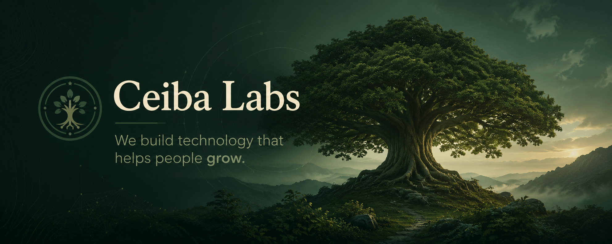

  

<h1 align="center">Ceiba Labs</h1>

  <strong>We build technology that helps people grow.</strong>

  

<h1 align="center">Ceiba Labs</h1>

<strong>We build technology that helps people grow.</strong>

Thoughtfully crafted software and digital products for people, families, and creators.

---

## About

Ceiba Labs is a software studio building thoughtful technology that makes everyday life better.

We believe great software is simple, reliable, and built with care. Every product starts with a real problem and is designed to serve people for the long term.

---

## Products

### 🌐 Lentri.nl

Thoughtful technology for everyday life.

### 🌳 Family Compass

Helping families stay connected.

### 📚 Open Source

Developer tools, libraries, and reusable components.

---

## Our Principles

- 🌱 Human-first
- ⚡ Simple by design
- 🔒 Privacy-conscious
- 🛠️ Built to last
- ❤️ Crafted with care
- 🌍 Think long-term

---

## Our Mission

> We build technology that helps people grow.

Technology should support people—not distract them.

Every product we create is built to make life a little simpler, calmer, and more meaningful.

---

**Technology • People • Growth**

Made with ❤️ by **Ceiba Labs**

  Thoughtfully crafted software and digital products for people, families, and creators.

---

## About

Ceiba Labs is a software studio dedicated to building technology that makes everyday life better.

We believe the best products aren't the ones with the most features—they're the ones that solve real problems through simplicity, thoughtful design, and long-term thinking.

Everything we build is guided by one mission:

> **We build technology that helps people grow.**

---

## Products

### 🌐 Lentri.nl

Our flagship platform focused on helping people discover, organize, and benefit from thoughtful technology in everyday life.

### 🌳 Family Compass

Helping families stay connected through simple, meaningful digital tools.

### 📚 Open Source

Libraries, templates, developer tools, and experiments shared with the community.

---

## Our Principles

- 🌱 Human-first
- ⚡ Simple by design
- 🔒 Privacy-conscious
- 🛠️ Built to last
- ❤️ Crafted with care
- 📖 Learn continuously
- 🌍 Think long-term

---

## Why We Build

Technology should support people—not distract them.

We create software that is calm, useful, and built to last. Every product starts with a real problem and is designed to make life a little simpler.

Whether it's for families, creators, developers, or individuals, our goal is always the same:

**Build technology that genuinely helps people grow.**

---

## Follow Our Journey

We're building one thoughtful product at a time.

⭐ Follow the organization to stay updated as new projects are released.

---

### Technology • People • Growth

Made with ❤️ by **Ceiba Labs**

